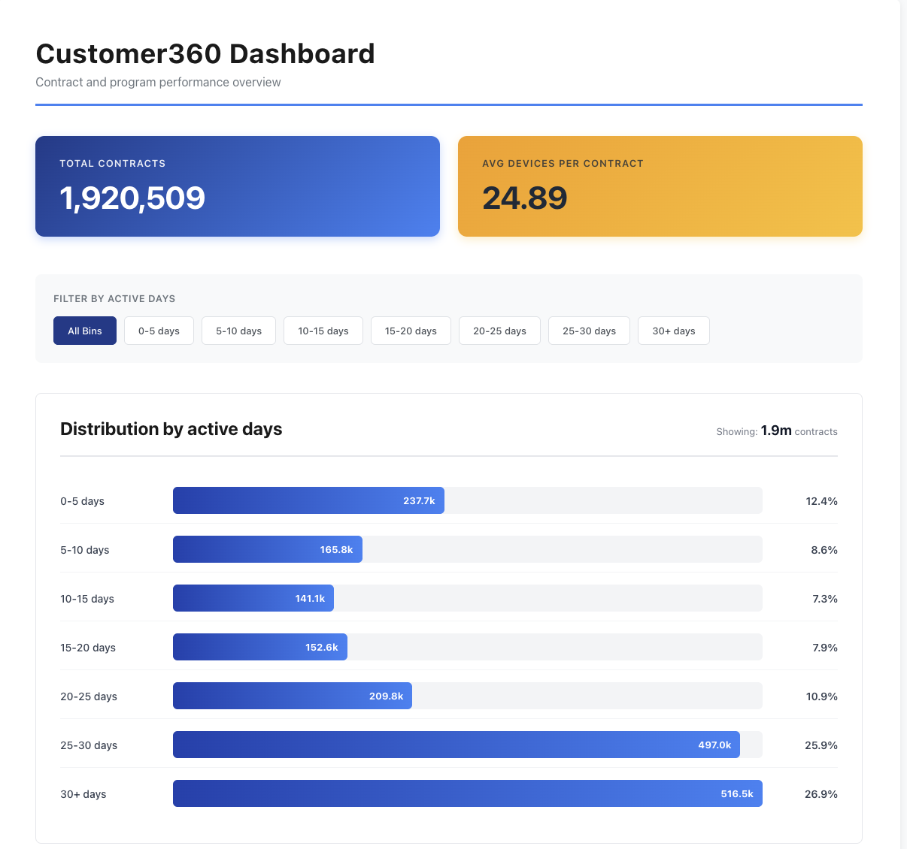
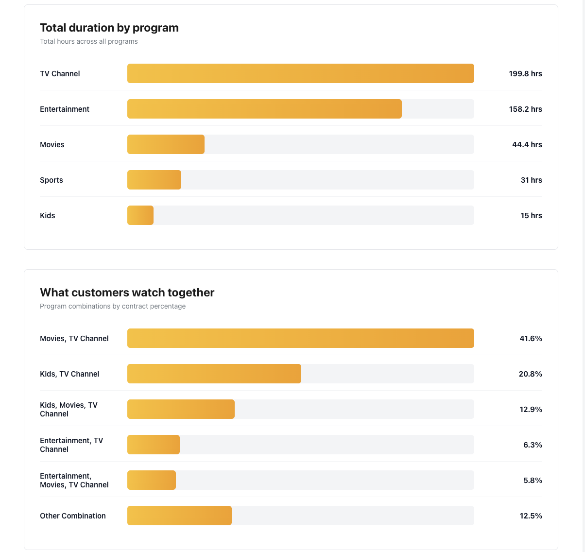
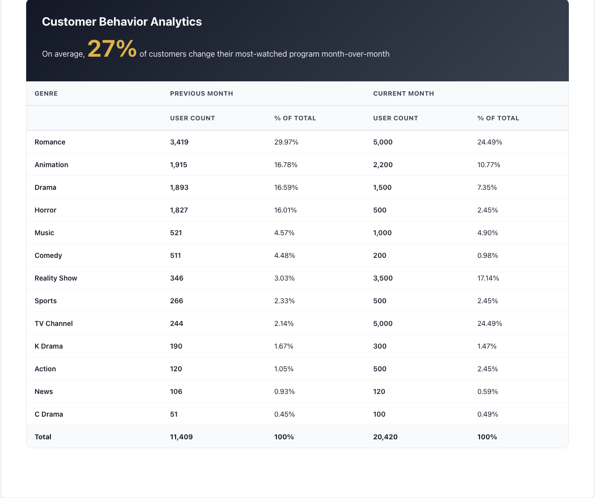

# 📊 CSM Analytics Dashboard

Interactive dashboard built on top of curated Databricks views.

## Live Demo
👉 https://claude.ai/public/artifacts/b9b394f8-2cd3-4f12-88ce-a5628b7c3a92

## Data Sources

Built on top of curated SQL views from `src/sql_modeling/`.

The dashboard reads from:

| View | Purpose |
|------|---------|
| vw_contract_active_days_distribution | Active day histogram |
| vw_program_duration_contract_stats | Duration KPI by program |
| vw_customer_taste_contract_devices | Taste distribution |
| top10_contract_by_program() | Parameterized ranking |

Features:
- Active days distribution
- Duration by program
- Customer taste breakdown
- Customer behavior breakdown

Preview:

## Architecture

ETL → Delta Facts → SQL Views → Dashboard

## Local/Alt Deployment (future)
- Streamlit
- Tableau Public
- Databricks SQL Dashboard
